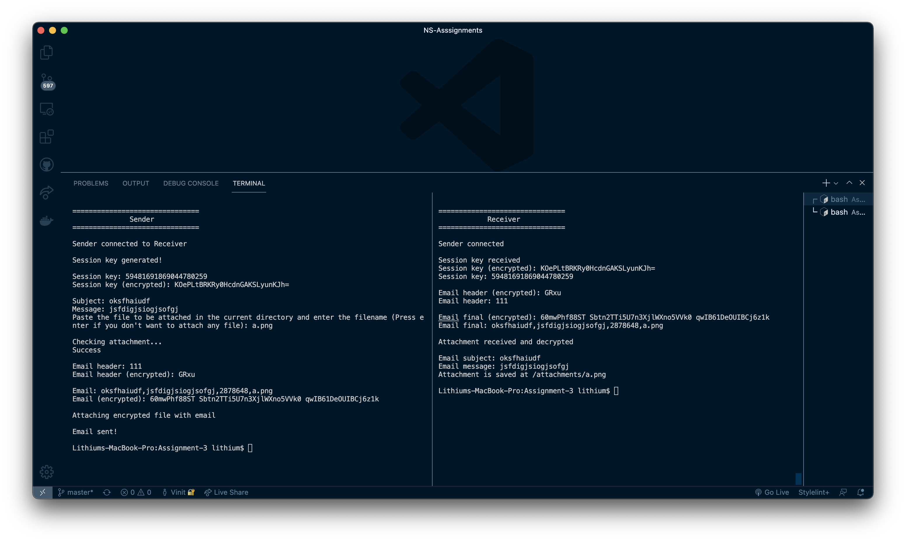

# Semester V : NS (Network Security) C2 Asssignment 3
___
## Team members 
### [IIT2019194 - Rahul Roy](https://github.com/Rahul171201)
### [IIT2019198 - Nischay Nagar](https://github.com/nischaynagar)
### [IIT2019213 - Vikram Singh](https://github.com/vikram605)
### [IIT2019229 - Navneet Bhole](https://github.com/Ephiret)
### [IIT2019232 - Vinit Wagh](https://github.com/vvvinit)
### [IIT2019234 - Pravallika Kodi](https://github.com/iit2019234)
___
## Topic
Implementation of ‘S/MIME Email Encryption’ using C++ and MIRACL Cryptographic SDK.
___

## Working

___
