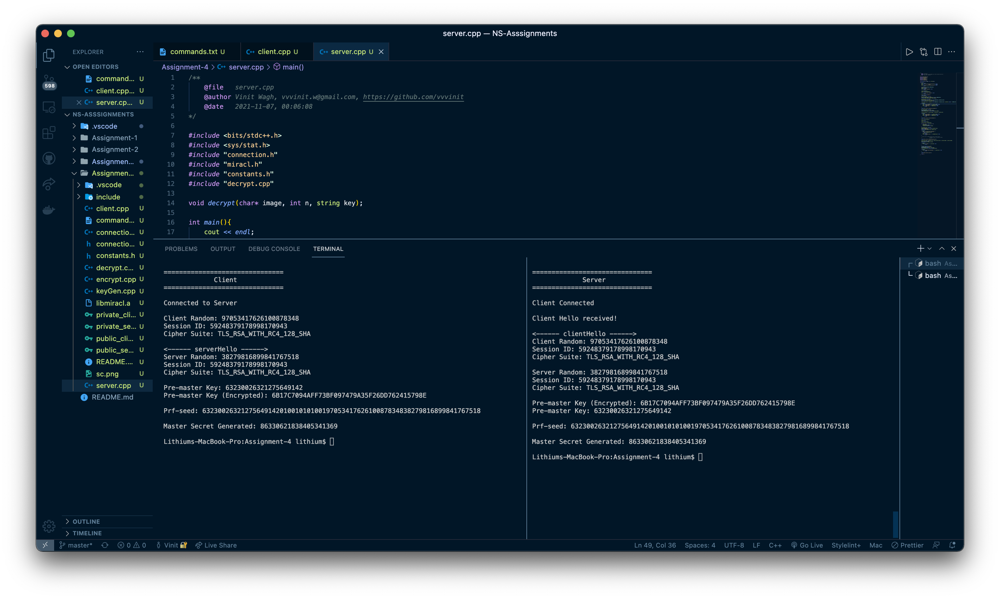

# Semester V : NS (Network Security) C2 Asssignment 4
___
## Team members 
### [IIT2019194 - Rahul Roy](https://github.com/Rahul171201)
### [IIT2019198 - Nischay Nagar](https://github.com/nischaynagar)
### [IIT2019213 - Vikram Singh](https://github.com/vikram605)
### [IIT2019229 - Navneet Bhole](https://github.com/Ephiret)
### [IIT2019232 - Vinit Wagh](https://github.com/vvvinit)
### [IIT2019234 - Pravallika Kodi](https://github.com/iit2019234)
___
## Topic
Implementation phase 1 of the handshake protocol (ignore version and the Compression Method). After that calculated the Master secret using the pre-master secret. Cipher suite is given as (TLS_RSA_WITH_RC4_128_SHA).
___

## Working

___
